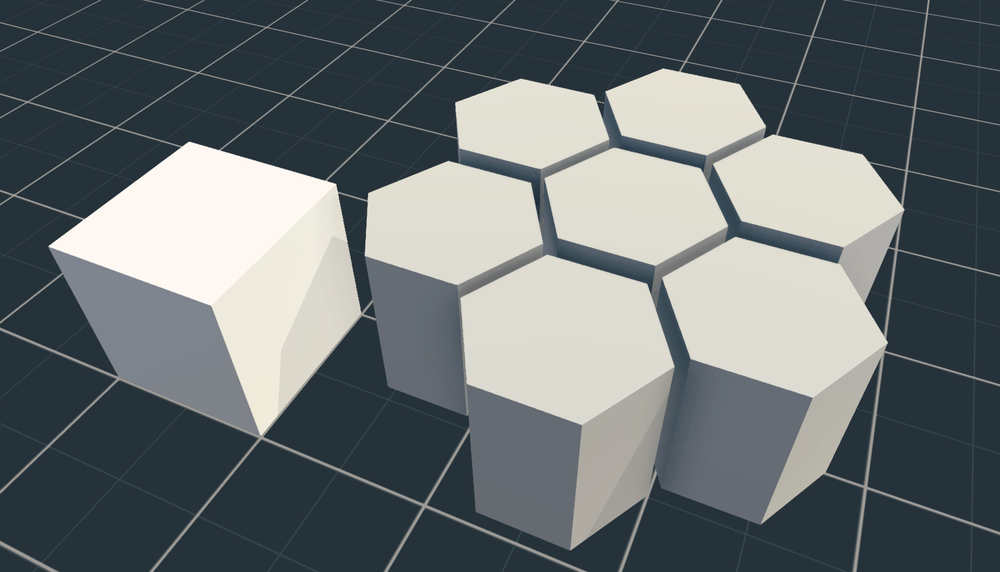

# Hexagon

Simply exporting a Hexagon from Blender to an OBJ wouldn't work in AssetForge.  I had to change the faces of the endcaps from ngons to triangles.  This worked appropriately.  I really like AssetForge and was surprised when I discovered it didn't contain a hexagon, so I made up one to share.  It's a simple object, nothing fancy, but I'm sure it can be used by others.

